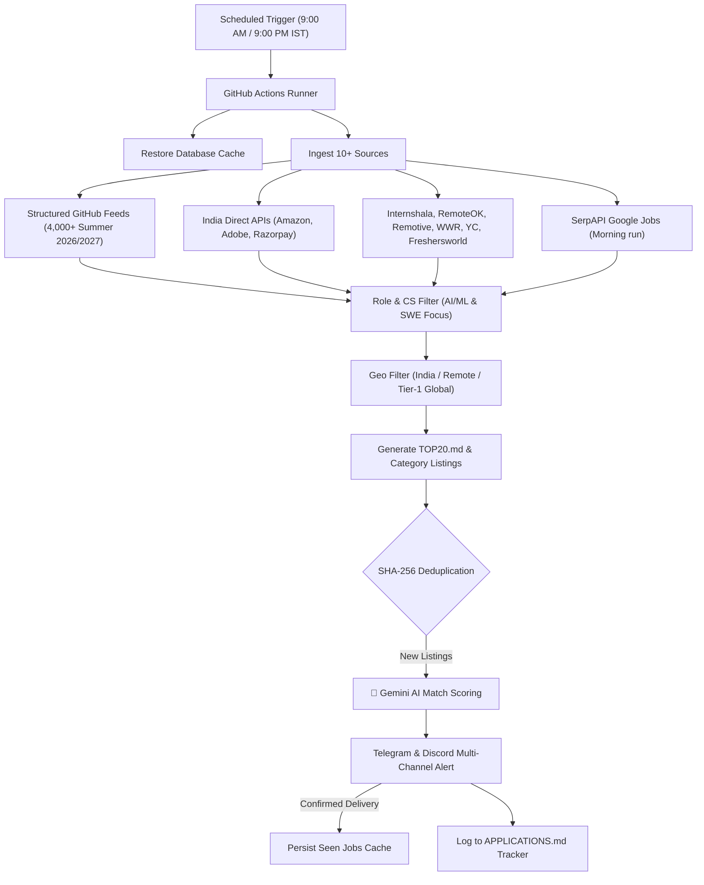

# 🚀 AI-Powered Internship Tracking & Alert Engine

> **Personalized AI Career Agent for B.Tech Computer Science & Engineering (Batch of 2028 — NMAMIT)**  
> Continuously aggregates **4,500+ internship listings** across 10+ platforms, prioritizes **AI/ML & SWE roles**, evaluates candidate fit using **Google Gemini AI**, pushes instant alerts to **Telegram & Discord**, and provides a built-in **application tracker** with follow-up reminders.

---

## 🎯 Candidate Profile & Focus

| Attribute | Details |
|---|---|
| **Candidate** | B.Tech Computer Science & Engineering, NMAM Institute of Technology (NMAMIT) |
| **Graduation** | **Batch of 2028** (Current: 3rd Year / 5th Semester) • **CGPA:** ~8.45 |
| **Primary Target Roles** | **AI/ML Engineer Intern**, **Machine Learning Intern**, **AI Engineer Intern**, **GenAI Intern**, **LLM/LLM Engineering Intern**, **Data Science Intern**, **Applied AI Intern**, **ML Engineering Intern** |
| **Secondary Roles** | **Software Engineering Intern**, **Backend Engineering Intern** |
| **Core Stack** | Python, TensorFlow, scikit-learn, NumPy, Pandas, Machine Learning, Deep Learning, GenAI/LLMs, Java, C, Data Structures & Algorithms (DSA), REST APIs, Git |
| **Location Target** | **India-based** (Bangalore, Hyderabad, Pune, Mumbai, Delhi-NCR, Mangalore, Udupi, Remote) or **Global Remote** |

---

## ✨ System Highlights

| Feature | Description |
|---|---|
| 📡 **10+ Data Sources** | **Structured GitHub Feeds** (SimplifyJobs & vanshb03 Summer 2026/2027), **IndiaDirect APIs** (Amazon Student Programs, Adobe Workday CXS, Razorpay Workable), **Internshala**, **RemoteOK**, **Remotive**, **WeWorkRemotely**, **YCombinator (HN)**, **Freshersworld**, and **SerpAPI (Google Jobs)**. |
| 🧠 **Gemini AI Match Scoring** | Evaluates listings against your exact profile, scoring 0–100%, generating an AI fit insight, and drafting a tailored LinkedIn outreach message for scores ≥ 80%. |
| 🔔 **Dual Notifications** | Telegram MarkdownV2 alerts and Discord rich embeds dispatched concurrently with automatic rate-limit backoff. |
| 🎯 **AI/ML Priority Engine** | AI, GenAI, and ML listings are scored and prioritized ahead of generic roles. |
| 📝 **Built-in Application Tracker** | Track where you applied, interview status, and `Days Since Applied` to ensure no opportunity goes stale. Generates [`APPLICATIONS.md`](APPLICATIONS.md). |
| 🏆 **Daily Top 20 Shortlist** | Generates [`TOP20.md`](TOP20.md) ranked by AI/ML role relevance, company tier (Tier-1 Tech/Quant & YC Startups), and freshness. |
| 🛡️ **SHA-256 Deduplication** | URL normalization strips tracking query parameters before hashing — 0% duplicate notification rate. |
| ⚡ **GitHub Actions Hosted** | Runs serverless twice daily (9:00 AM & 9:00 PM IST) using GitHub Actions Cache — zero server maintenance. |

---

## 🏗️ System Architecture



---

## 📱 What An Alert Looks Like

```text
🧪 Machine Learning Systems SDE Intern - Annapurna Labs
━━━━━━━━━━━━━━━━━━━
🏢 Amazon
📍 Bangalore 🇮🇳 India
🏷 Internship • 🧠 AI/ML • 🏢 IndiaDirect
📊 Match: 94%
💡 Strong match for NMAMIT CSE '28 profile — requires Python, distributed ML systems, and DSA foundations.
⏱ Posted: Today

✉️ Hi [Hiring Team], I noticed Amazon is hiring an ML Systems SDE Intern for Annapurna Labs. 
   As a 3rd-year CS student at NMAMIT with practical experience training models in TensorFlow 
   and strong DSA fundamentals, I would love to connect and contribute!

🔗 Apply Now → https://www.amazon.jobs/...
📝 Log App: npm run track -- add "Amazon" "ML Systems SDE Intern"
```

---

## ⚡ Quick Setup (5 Minutes)

### 1. Clone & Install Dependencies

```bash
git clone https://github.com/YOUR_USERNAME/ai-internship-tracker.git
cd ai-internship-tracker
npm install
```

### 2. Configure Environment Variables

Create `.env` from `.env.example`:

```bash
cp .env.example .env
```

| Variable | Required | Description |
|---|---|---|
| `TELEGRAM_BOT_TOKEN` | Yes | Token from `@BotFather` on Telegram |
| `TELEGRAM_CHAT_ID` | Yes | Your Telegram user or channel ID |
| `DISCORD_WEBHOOK_URL` | Yes | Discord channel Webhook URL |
| `GEMINI_API_KEY` | Recommended | Free key from [Google AI Studio](https://aistudio.google.com) |
| `SERPAPI_KEY` | Optional | Key from [serpapi.com](https://serpapi.com) (250 free searches/month) |
| `USE_LLM` | Optional | Set `true` to enable Gemini AI evaluation |
| `USE_SERPAPI` | Optional | Set `true` to enable Google Jobs searches |

### 3. Run Locally

```bash
# Run unit & integration test suite
npm test

# Test scraping in dry-run mode (no messages sent)
npm run dry-run

# Run full pipeline locally with alerts
npm start
```

---

## 📝 Personal Application Tracker CLI

The built-in tracker logs your applications directly into [`data/applications.json`](data/applications.json) and formats [`APPLICATIONS.md`](APPLICATIONS.md).

```bash
# Log a new application
npm run track -- add "Google" "AI/ML Intern" "2026-10-02" "Applied" "Referred by senior" "https://careers.google.com"

# Update an application status (index from table)
npm run track -- update 1 "Interview" "Round 1 technical on Zoom"

# View current applications in terminal
npm run track -- list

# Regenerate APPLICATIONS.md
npm run render
```

### Supported Statuses:
- `Applied` (Default)
- `Screening`
- `Assessment` (Online Assessment)
- `Interview`
- `Offer`
- `Rejected`
- `Ghosted` (Flags after 14–30 days with `⚠️ Follow-up`)

---

## 📂 Project Structure

```text
ai-internship-tracker/
├── .github/workflows/
│   ├── scrape-morning.yml        # 9:00 AM IST — Full run (SerpAPI + Gemini AI + TOP20)
│   ├── scrape-evening.yml        # 9:00 PM IST — Evening run (Free sources + TOP20)
│   └── scrape-seed.yml           # One-time initial catalogue seed
├── data/
│   ├── resume_profile.json       # NMAMIT 2028 candidate profile (edit to customize)
│   ├── applications.json         # Local application tracker database
│   └── seen_jobs.json            # Deduplication hash database
├── listings/
│   ├── ai-ml-data-science.md     # Auto-generated active AI/ML listings
│   ├── software-engineering.md   # Auto-generated active SWE listings
│   └── india-internships.md      # Auto-generated domestic India roles
├── src/
│   ├── core/
│   │   ├── database.js           # SHA-256 deduplication & URL cleaning
│   │   ├── digestGenerator.js    # TOP20 recommendation & listings generator
│   │   ├── filter.js             # CS & AI/ML role relevance filter
│   │   ├── formatter.js          # Telegram & Discord message formatters
│   │   ├── geoFilter.js          # India & Remote geographic filter
│   │   ├── llmEvaluator.js       # Google Gemini AI match scoring & pitches
│   │   └── tracker.js            # Personal application tracker CLI
│   ├── notifiers/
│   │   ├── discord.js            # Discord webhook broadcaster
│   │   └── telegram.js           # Telegram bot notifier
│   ├── scrapers/
│   │   ├── githubFeeds.js        # SimplifyJobs & vanshb03 JSON feeds
│   │   ├── indiaDirect.js        # Amazon, Adobe, Razorpay direct APIs
│   │   ├── internshala.js        # Internshala scraper
│   │   ├── freshersworld.js      # Freshersworld fresher job scraper
│   │   ├── remoteok.js           # RemoteOK API scraper
│   │   ├── remotive.js           # Remotive API scraper
│   │   ├── serpapi.js            # Google Jobs SerpAPI engine
│   │   ├── weworkremotely.js     # WeWorkRemotely RSS parser
│   │   ├── ycombinator.js        # Hacker News "Who is hiring" parser
│   │   └── index.js              # Scraper orchestrator
│   └── main.js                   # Master pipeline runner
├── tests/
│   └── runTests.js               # Comprehensive test suite (13 tests)
├── APPLICATIONS.md               # Application tracking dashboard
├── TOP20.md                      # Daily top 20 curated recommendations
├── package.json
└── README.md
```

---

## 🛠️ Verification & Testing

Run the automated test suite anytime with:
```bash
npm test
```
The suite verifies:
- Primary AI/ML & secondary SWE role matching.
- Negative filtering (sales, HR, civil, mechanical, senior roles).
- Geography filter accuracy and Indianapolis / Indiana false-positive protection.
- URL normalization and hash stability.
- Application tracker CRUD operations and markdown generation.
- Recommendation scoring logic.
